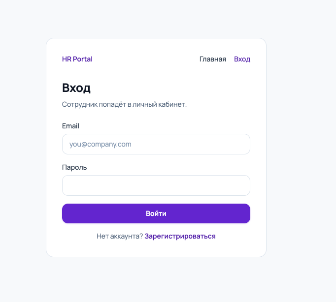
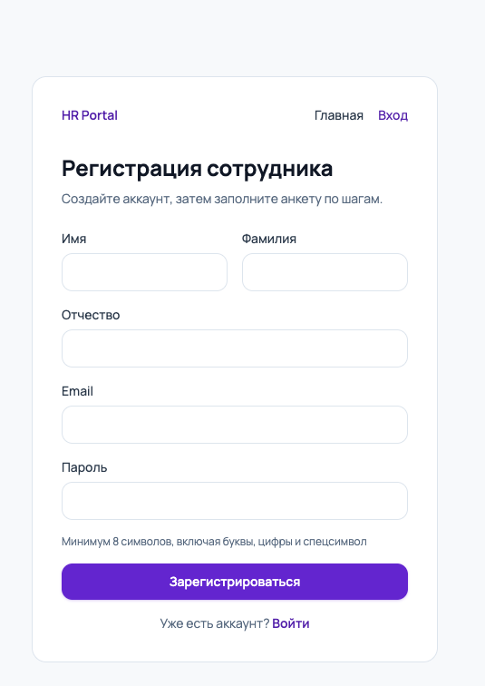
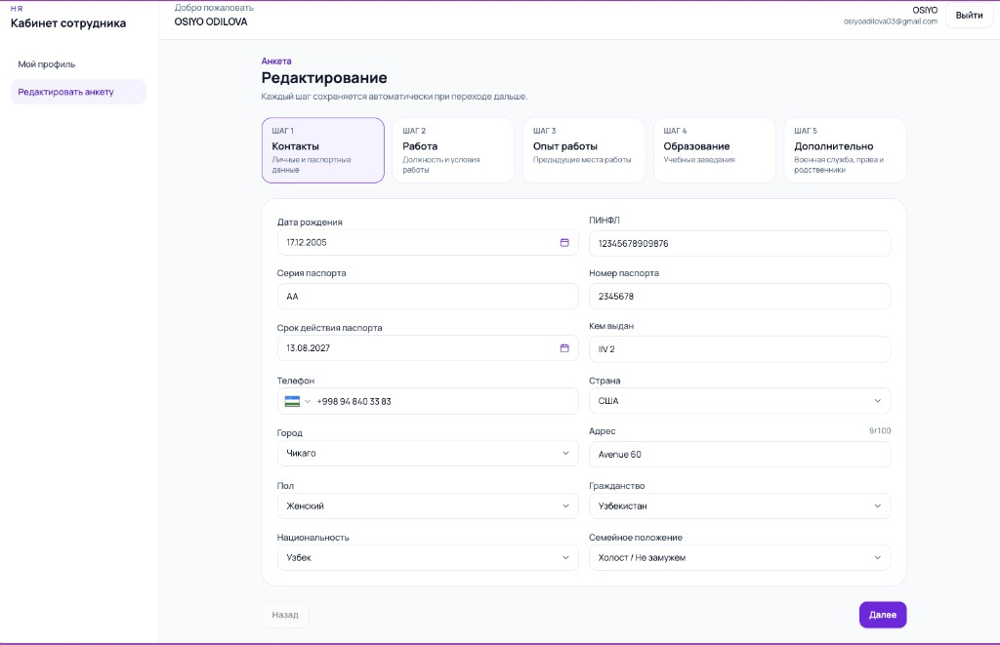
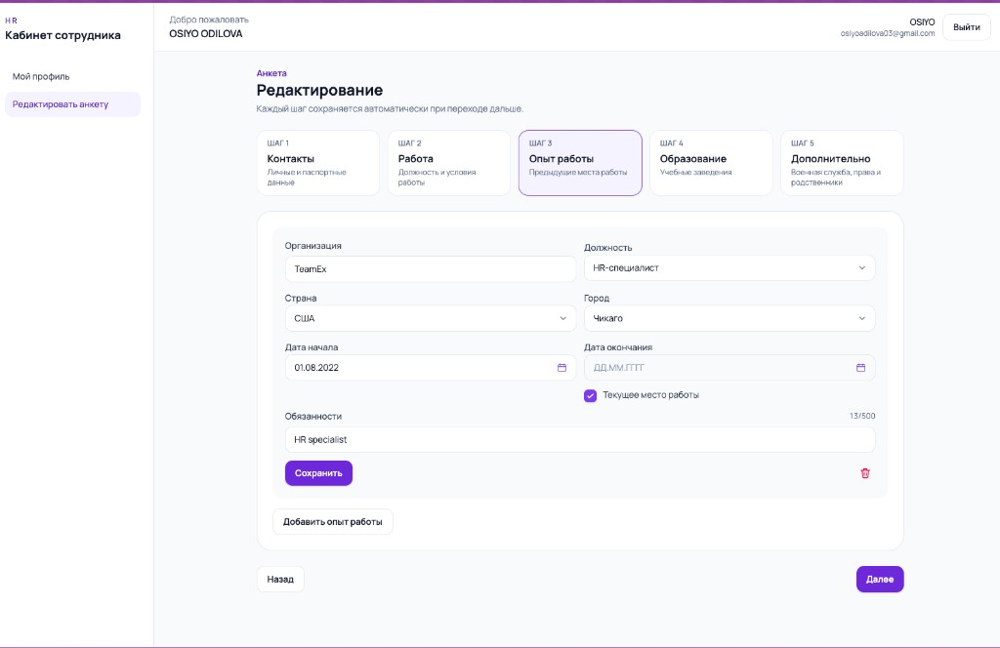
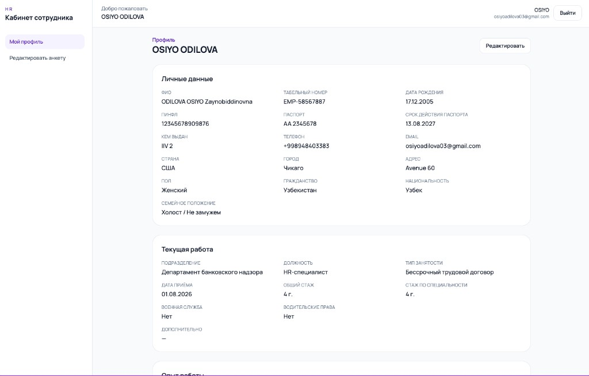
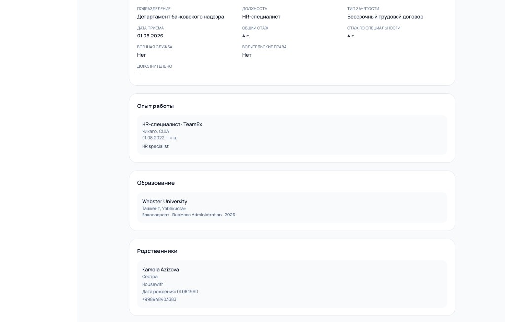
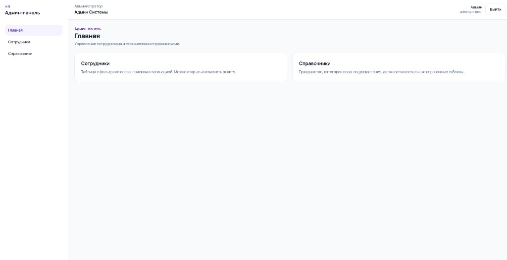
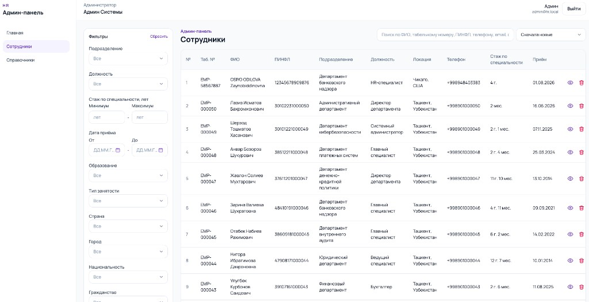
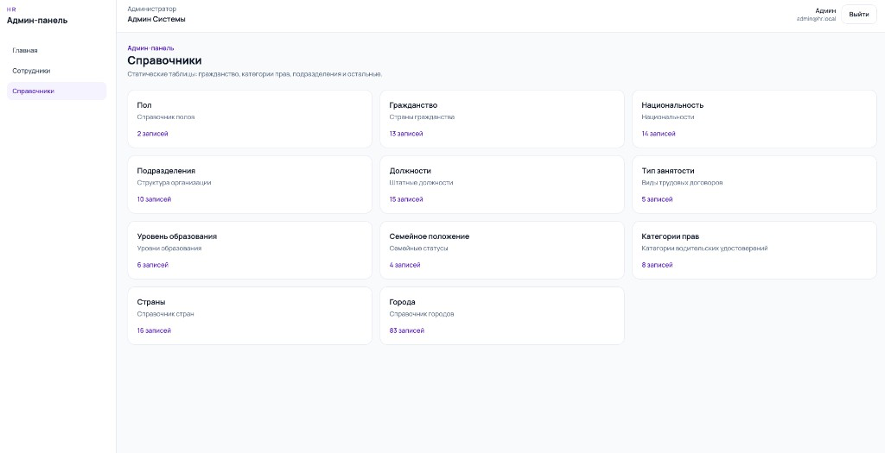
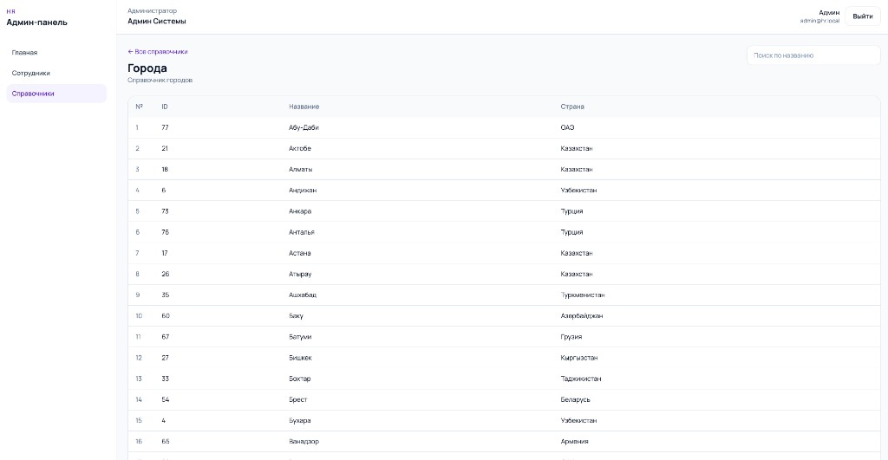

# HR Employee Management App

## About the project

This is an employee management HR app.

Employees can register, log in, and fill in their own profile:

- personal details
- current position in the organization
- work history
- education
- extra information (driver license, military status, marital status)
- relatives

There is also an admin panel. The admin can see all employees, search them, and filter the list. The admin can also open the reference tables used in the forms (cities, departments, positions, and similar lists).

## Roles

There are two roles: **employee** and **admin**.

Login uses email and password. The app checks the user with a JWT token.

### Employee

- can register and log in
- can create and update only their own profile
- cannot see or change other employees
- can use reference lists in the forms (dropdowns), but cannot open the full admin tables

### Admin

- can log in to the admin panel
- can see all employees
- can search and filter employees
- can read, update, and delete any employee
- can open all reference tables used in the app

## Tech

- Frontend: React (Vite)
- Backend: NestJS
- Database: PostgreSQL
- Auth: JWT (email + password)

## Project structure

```
hr-app/
├── compose.yml          starts local PostgreSQL
├── docs/screenshots/    images for this README
├── backend/             API
└── frontend/            web app
```

### Backend (`backend/`)

```
backend/
├── prisma/
│   ├── schema.prisma          database models
│   ├── migrations/            database changes
│   ├── seed.ts                runs all seed files
│   ├── seed-references.ts     cities, departments, positions, and other lists
│   ├── seed-admin.ts          admin account
│   └── seed-employees.ts      demo employees
└── src/
    ├── security/              login, register, JWT, roles
    ├── employees/             employee data
    ├── educations/            education records
    ├── work-experiences/      work history
    ├── relatives/             relatives
    ├── references/            reference tables
    ├── prisma/                database connection
    └── common/                shared helpers
```

### Frontend (`frontend/`)

```
frontend/src/
├── app/                       routes and access checks
├── features/
│   ├── auth/                  login and register pages
│   ├── admin/                 admin home
│   ├── employees/             employee list, profile, and form
│   └── references/            reference table pages
├── components/                layout and UI
└── services/                  API calls
```

## Screenshots

Login:



Registration:



Employee cabinet, step 1 (personal and passport data):



Employee cabinet, step 3 (work experience):



Employee cabinet, profile view:



Employee cabinet, profile view (work, education, relatives):



Admin panel, home:



Admin panel, employees table with filters:



Admin panel, reference tables:



Admin panel, cities reference table:



## How to run

You need Node.js, npm, and Docker.

### 1. Start the database

```bash
docker compose up -d
```

### 2. Start the backend

```bash
cd backend
cp .env.example .env
npm install
npm run db:setup
npm run start:dev
```

API: http://localhost:3000  
API docs: http://localhost:3000/api

`npm run db:setup` creates the database tables and loads demo data (reference lists, admin, employees).

### 3. Start the frontend

```bash
cd frontend
cp .env.example .env
npm install
npm run dev
```

App: http://localhost:5173

## Demo accounts

Admin:

- email: `admin@hr.local`
- password: `Admin123!`

Employee (example):

- email: `seed.employee01@hr.local`
- password: `Employee123!`

There are 50 demo employees: `seed.employee01@hr.local` … `seed.employee50@hr.local`. All of them use the same password.
